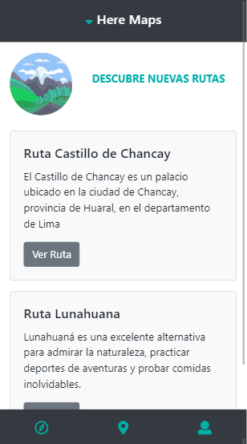

# Here Maps

* **Track:** _FRONT-END-DEVELOPER_
* **Reto:** _Here Maps_

***

## Introducción

Aplicación móvil que permite a los usuarios trackear y monitorear recorridos que realice en senderos al aire libre/outdoor, orientado a los amantes de las actividades de aventura (montañas, lagos, parques, etc.) en Perú.

## Plan de trabajo

Para el proyecto se crearon los siguientes issues y milestones que sirven como hoja de ruta (roadmap):

* Maquetado.
* Inicializar el proyecto con babel y webpack.
* Agregar dependencias.
* Identificar y crear componentes.
* Obtener mapa con coordenadas determinadas.
* Generar data para desplegar lista de rutas guardadas.
* Elaborar readme.

## Especificaciones

* Se utilizaron las siguientes dependencias: React, React-router, Webpack, propTypes y Google-maps (Principales).
* Se utilizó el framework bootstrap en su versión 4.
* Se utilizó el estándar más recientemente aceptado de JavaScript ES2015 || ES6.
* Se utilizó el transpilador/compilador Babel para que convierta nuestro código en ES5 de forma automática.
* Diseño responsive y mobile.

## Instrucciones 
Para usar la aplicación, siga los siguientes pasos:

```bash
git clone https://github.com/Rocciescobar/HereMaps.git
cd HereMaps
npm install (bajas todas las dependencias)
npm start 
```

***

## Uso
* Se tiene un footer donde se presentan tres vistas principales de la palicación.
* En el ícono del centro, se tiene a la vista home, donde se imprime un mapa con una coordenada predeterminada.
* En el ícono de la derecha, se muestra el perfil del usuario con una lista de sus rutas guardadas.
* En el icono de la izquierda, se muestra la vista Explorer, donde el usuario puede encontrar nuevas rutas que comparten otros usuarios.

## Ejemplo

* Vista Home:


* Vista Profile:


* Vista Explorer:



***

## Autoras

* Rocci Escobar Nuñez
* Elizabeth Segura